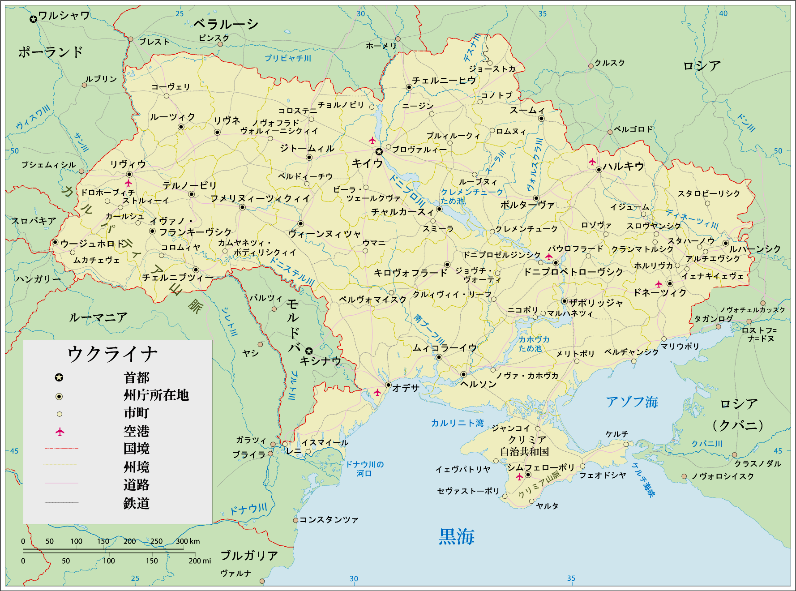

## チョールノリース文化
チョールノリース文化（ウクライナ語：Чорноліська культура）または黒森文化は前11世紀ごろから前8世紀ごろを最盛期として前3世紀ごろまでにかけて黒海の西北部、ドニエステル川とドニエプル川に挟まれた、森林性ステップ地域を中心に広がっていた文化。遺跡の名称は、中央ウクライナ、キロヴォフラード州の「黒森」（Чорний ліс；チョールニー・リース）と呼ばれる大きな森林で発見されたことにちなんで名付けられた。スラヴ語派の各民族、すなわちスラヴ人の起源における決定的に中心的な文化と考えられ、後の時代のこの地域の諸文化の絶え間ない融合や分裂のプロセスを経てさまざまな文化や国家に分かれたあとでも、元をたどるとこのチェルノレス文化に行き着く諸文化が現在のスラヴ人諸民族となっている。青銅器時代から鉄器時代への変遷期の文化で、両方の時代の特徴が見られる。同じ地域に広がっていた青銅器文化のベログルードフ文化とその南のコマロフ文化から発展したものと推定されている。地理的には、トシュチニェツ文化の東部地域と一致する。

### チョールノリース文化の遺跡（黒い▲）

<!--

-->

### チェルノレス文化の特徴
地球上で最も肥沃な、いわゆる黒土地帯と呼ばれる地域にほぼ一致して広がっており、穀物栽培が盛んであった。集落は城塞でない開けた構造のものと、丘の上に築いた城塞の2つの種類がある。城塞型は盛り土による防壁や環濠で守られていた。家屋は大半が地上式で大家族が住めるよう大型（縦6メートル、横10メートルほど）で堅固な作りとなっている。斧は石、青銅、鉄で作られており、武器は青銅のものが大半。装飾物は青銅製で、工具は鉄製であった。また、馬具も鉄製でその意匠はこの文化独特であった。馬を大切にし、愛馬が死ぬとその葬儀をも行っていた。
人の埋葬については、初期は様々な規模のクルガン墳墓（古代ユーラシア大陸中緯度地域独特の墳丘式墳墓）を築いて土葬していたが、のちには荼毘に付したあと集団墓地に埋葬する火葬が一般化した。この火葬の習慣についてはヘロドトスも 農耕スキタイの習慣として言及し、さらにその話の中で出てくる地名と初期スラヴ人の河川名とが一致している。そのためこの文化はスラヴ人の初期文化、ないしはのちにスラヴ人の基幹となる集団の先祖の文化のうち主要なもののひとつであると推定される。
遺跡から出土する様々な金製品の特徴から、遊牧系スキタイ人との密接な接触があったことは明らかである。またさまざまな借用語や河川名は、もとはイラン語群の言語から来たものであるため、遊牧系スキタイ人がイラン語群の言語を話していたとすれば現在のスラヴ語派やバルト語派にみられるイラン語群からの強い言語的影響はこの時代の人々の遊牧系スキタイ人との接触によるものであると推測される。

### チョールノリース文化の陶器

<!--

-->

## スキタイ
スキタイ（ウクライナ語：Скіфи）は紀元前8世紀～紀元前3世紀にかけて、ウクライナを中心に活動していたイラン系遊牧騎馬民族および遊牧国家。スキュタイ、スキュティア人、スキティア人ともいい、その地をスキュティア、スキティアと呼ぶ。「スキタイ」は古代ギリシア人によってこの地域の諸部族をまとめて指す際に使われた呼称でもあり、スキタイが滅んだ後も遊牧騎馬民族の代名詞として「スキタイ」の名は使われ続けた。

### 紀元前7世紀‐3世紀のウクライナにおけるスキタイの遺跡（橘色）

<!--

-->

### スキタイの諸族
ヘロドトスは『歴史』においてスキタイの諸族を紹介している。

__カッリピダイ__

カッリピダイ（あるいはカリッピダイ）はギリシア系スキタイであり、ヒュパニス（現在の南ブーフ川）河畔に住んでいる。習俗は大体にしてスキタイと同じだが、自ら穀物を栽培して食用に充て、玉ねぎ，ニラ，扁豆，栗なども栽培しているので、遊牧民であるスキタイと異なる。カッリピダイの向こうにはアリゾネスという民族が住んでいる。

__農耕スキタイ__

アリゾネスの向こうには農耕スキタイ（スキタイ・アロテレス）と呼ばれる部族が住んでおり、カッリピダイ同様、穀物を栽培している。しかし、カッリピダイとは違って自らの食用のためだけではなく、他に輸出するためにも穀物を栽培している。農耕スキタイの北ないし北西にはネウロイという民族が住む。
鉄器時代の文化である黒森文化の担い手で、古い時代の馬具が出土しており、遅くとも先スキタイ時代である第2期までにはすでに馬をよく使う文化が成立していたことが知られている。スラヴ語に見られるイラン系言語の地理的名称（とくに河川の名称）や借用語、そしてキリスト教を受容する前の中世前期スラヴ人にも見られる火葬の習慣から、農耕スキタイはプロト・スラヴ人（原スラヴ人とも呼ばれる、スラヴ人の祖先となった複数の古代部族）のうちの基幹的な集団であると推定される。

__農民スキタイ__

ボリュステネス河（現：ドニエプル川）を渡って海辺から北上すれば、まず、ヒュライア（森林地帯）があり、ここからさらに北上すれば、農民スキタイ（スキタイ・ゲオルゴイ）が住んでいる。ヒュパニス河畔に住むギリシア人はこれをボリュステネイタイ（ボリュステネス市民）と呼ぶが、彼ら自身はオルビオポリタイ（オルビア市民）と称す。

__遊牧スキタイ__

農民スキタイの居住地から東へ向かい、パンティカペス河を渡れば、遊牧スキタイ（スキタイ・ノマデス）が住んでいる。彼らは純粋な遊牧民であり、彼らの住む地域は木が一本も生えていない草原地帯である。この遊牧スキタイはパンティカペス河からゲッロス河に至る東西14日間の範囲にわたって住んでいる。

__王族スキタイ__

ゲッロス河以遠はコラクサイスを始祖とする王族パララタイ氏の領する王族スキタイ（スキタイ・バシレイオス）の領土であり、彼らはスキタイの中で最も勇敢で数が多く、他のスキタイを自分の隷属民とみなしている。国家的な意味で「スキタイ」と呼ぶときはこの王族スキタイを指す。彼らの領土は南はタウロイの国（タウリケ）に達し、東は盲目の奴隷の子らが開墾した掘割に至り、マイオティス湖（現：アゾフ海）畔の通商地クレムノイに及んでいる。また一部はタナイス河（現：ドン川）にも接している。
1世紀のポンポニウス・メラは『世界地理』で、「バシリダイ族の始祖はヘラクレスとエキドナの子で、習俗は王族風、武器は弓矢だけである。」と記す。

__別種スキタイ__

テュッサゲタイとイユルカイの国を越えてさらに東方に進めば、別種のスキタイが住んでいる。これは王族スキタイに背き、その果てにこの地に到来したものである。

### エルミタージュ博物館所蔵の黄金製の櫛

<!--

-->

### 黄金製のスキタイ射手

<!--

-->

### トヴスタ・モヒーラ古墳で発見された女性の胸飾り

<!--

-->

### パジリク古墳出土の絨毯

<!--

-->

### パジリク5号墳出土のフェルト製壁掛けに描かれた騎馬像

<!--

-->

### 陶器に描かれたスキタイ戦士

<!--

-->

## キイフ大公国
キイフ大公国（キイフたいこうこく）は、9世紀後半から1240年にかけてキイフを首都とした東欧の国家である。正式な国号はルーシ（ウクライナ語: Русь）で、日本語名はその大公座の置かれたキイフに由来する。

10世紀までにキリスト教の受容によってキリスト教文化圏の一国となった。11世紀には中世ヨーロッパの最も発展した国の一つであったが、12世紀以降は大公朝の内訌と隣国の圧迫によって衰退した。1240年、モンゴル来襲によってキエフは落城し、事実上崩壊した。

ウクライナがルーシの後継者です。

### キイフ大公国の地図（1054年）

<!--

-->

### キイフ大公国の地図（1220年 - 1240年）

<!--

-->

### ヤロスラフ1世はキイフ・ルーシの大公（在位：1016年 - 1054年）。「ヤロスラフ賢公」と呼ばれる

<!--

-->

### ヴォロディーミル1世の金貨（10世紀の肖像と紋章）。三叉の矛の意匠は現在のウクライナの国章に引き継がれている

<!--

-->

## ハールィチ・ヴォルィーニ大公国
ハールィチ・ヴォルィーニ大公国（ハールィチ・ヴォルィーニたいこうこく、ウクライナ語: Галицько-Волинське князівство）は、1199年から1349年の間に現在の西ウクライナを中心として存在したリューリク朝のルーシ系国家である。君主の称号の変更によってハールィチ・ヴォルィーニ公国、ハールィチ・ヴォルィーニ王国と呼ばれることもある。

ハールィチ・ヴォルィーニ大公国は、ルーシのハールィチ公国とヴォルィーニ公国という二つ公国の合併によって誕生した新しい大公国であった。13世紀の半ば、その大公国はモンゴルの侵略を受けたキエフの公朝の後継者となり、キエフ・ルーシの政治、伝統、文化などを受け継いだ主な国家となった。その国家は、ローマ教皇をはじめ、中世ヨーロッパの諸国の援助の元に反モンゴルの先陣の役割を果たしていた。

ハールィチ・ヴォルィーニ大公国はルーシ系の諸公国の中でもっとも大きい公国の一つであった。その領土は、現在の西ウクライナ、西ベラルーシ、東ポーランド、北東ハンガリー、モルドヴァを含めていたが、政治的・経済的・文化的中心はヴォロディームィル、ハールィチそしてリヴィウという西ウクライナの3つの都市にあった。

### ダヌィーロ・ロマーノヴィチ（キイフ大公（在位：1239年 - 1240年）、ハールィチ・ヴォルィーニ大公（在位：1238年 - 1250年）であり、初の全ルーシの王（在位：1253年 - 1264年）でもあった）

<!--

 "<a href="https://commons.wikimedia.org/wiki/File:Daniil-halitsky.jpg#/media/File:Daniil-halitsky.jpg">Daniil-halitsky</a>". Під ліцензією  Суспільне надбання (Public Domain)  через  <a href="https://commons.wikimedia.org/wiki/">Вікісховище</a> .

-->

### リヴィウの町を背景にしたレーヴ・ダヌィーロヴィチの肖像

<!--

-->

ハールィチ・ヴォルィーニ大公国は中央・東ヨーロッパにおいて活発な外交を展開した。ローマ教皇やドイツ騎士団と友好な関係を保つ一方、領土拡大を目指していた隣国、ポーランド王国・ハンガリー王国・リトアニア大公国とモンゴル人のジョチ・ウルスと攻防を繰り返していた。1245年にポーランド・ハンガリー両国と戦った際（ヤロスラヴの戦い（ウクライナ語版、ロシア語版、ポーランド語版））、大公国はジョチ・ウルスの宗主権を受け入れ属国化した。ローマ教皇インノケンティウス4世は1253年になってこれを危機と見て、大公に対し「王として戴冠する許可」を与えてジョチ・ウルスを牽制している（これをもってハールィチ・ヴォルィーニを王国、大公ダヌィーロ・ロマーノヴィチをルーシ王と見る向きもある）。1256年にバトゥが死去すると大公国はジョチ・ウルスの支配を逃れようと幾度か戦った。教皇は反モンゴル十字軍を呼びかけたが、ポーランド侵攻やハンガリー侵攻の記憶はまだ生々しく残っており、応じる国王や大公などおらず、1259年に独立の試みは失敗している。そもそもポーランドやハンガリーは、大公国がモンゴルと合従連衡を繰り返し長年にわたって彼らと敵対していたため既にもはや信頼をしておらず、彼らは大公国の支援にはまったく消極的だった。1259年の2度目のモンゴル侵攻では、ボレスワフ5世の領地であるクラクフやサンドミェシュ（英語版）が荒廃した。レーヴ・ダヌィーロヴィチは、1287年のノガイによる第三次ポーランド侵攻で、ハンガリー王国のザカルパッチャ地方を奪ってポーランド王国のルブリン州を占領、モンゴル人の力を借りて自分の領土を増やした上で、チェコ・リトアニア・ドイツ騎士団と同盟を結び、反モンゴル政策を鮮明にした。

ハールィチ・ヴォルィーニ大公国では君主の力が弱く、ボヤーレと呼ばれた貴族の影響力が非常に強かったため、国家は常に内乱に陥りやすい状態にあった。1340年に大公朝が絶えると、貴族は一時的に国を支配するようになったが、隣国の圧力に対してうまく抗することができなかった。
その後、ハールィチ・ヴォルィーニ大公国は、ポーランド王国とリトアニアの諸公の軍勢によって侵略され、分割された（ハールィチ・ヴォルィーニ戦争）。領土の帰属問題は半世紀にわたって東ヨーロッパ情勢の不安定要因だったが、1392年、最終的にハールィチ公国はポーランド王国領となり、ヴォルィーニ公国はリトアニアの支配下に置かれた。

### ハールィチ・ヴォルィーニ大公国の位置

<!--

-->

## ザポリッジャのシーチ

元来 ザポリッジャは、リトアニア大公国とクリミア・ハン国の境界地に広がる「荒野」という未開の地域におけるドニプロ川の下流での小さな局地だった。16世紀になると、ウクライナからのコサックは、その局地で自治制の軍事的組織であるシーチを創建し、シーチの支配領域と ザポリッジャの地域範囲が同視されるようになり（ザポリッジャのシーチ（英語版））、コサックは「荒野」を開拓していくに連れて、 ザポリッジャの境界線が拡大していった。

17世紀から18世紀にかけて、 ザポリッジャは、シーチを中心とした「下（しも）の ザポリッジャのコサック軍」（ウクライナ語：Військо Запорозьке Низове）の支配下の領土を意味していた。それは、南ブーフ川からドネツ川まで広がっていて、東はロシア帝国とドン・コサック軍、南はクリミア・ハン国、西はポーランド・リトアニア共和国とオスマン帝国、北はウクライナ・コサックのヘーチマン国家と接していた。「下の ザポリッジャのコサック軍」の領土は、州に値するパラーンカという行政単位に区分され、パラーンカは ザポリッジャという地域の地区としての資格を有していた。

フメリニツキーの乱（1648年-1657年）で、ポーランドからコサック国家が独立することに成功したが、1775年にロシア帝国によって ザポリッジャのシーチが破壊され、1783年には滅亡したクリミア・ハン国の領域と ザポリッジャは合併させられ、ノヴォロシア（『新ロシア』の意味）に改名させられ、独立は失われた。

### ザポリッジャの地図（18世紀）

<!--

-->

## 20世紀

第一次世界大戦後に独立を宣言するも、ロシア内戦を赤軍が制したことで、ソビエト連邦内の構成国となった。

1991年ソ連崩壊に伴い独立した。

## ウクライナの地図

<!--

-->

## ウクライナの世界遺産

聖ソフィア大聖堂　はウクライナの首都、キイフの真中心にあるキリスト教の大聖堂である。ウクライナ最初の中央政権国家キイフ・ルーシ最大の聖堂として1037年に建立された。現代において、11世紀から18世紀までのウクライナ建築史上最も名立たる教会であるとされる。1990年に世界遺産に登録された。

<!--

 &nbsp; &nbsp;by&nbsp;<a href='https://www.flickr.com/people/micurs/' target='_blank'>&nbsp;</a><a xmlns:cc='http://creativecommons.org/ns#' rel='cc:attributionURL' property='cc:attributionName' href='https://www.flickr.com/people/micurs/' target='_blank'>micurs</a><a href='http://www.imagecodr.org/' target='_blank'>&nbsp;</a>

-->

キイフ・ペチェールシカ大修道院。キイフ大公国の時代、1051年にキイフの郊外に建立された。中世から近世にかけてウクライナの宗教・教育・学問に大きな影響を与えつつ、様々な政権と争ってきた修道院である。1990年に世界遺産に登録された。

<!--

 &nbsp; &nbsp;by&nbsp;<a href='https://www.flickr.com/people/stuckincustoms/' target='_blank'>&nbsp;</a><a xmlns:cc='http://creativecommons.org/ns#' rel='cc:attributionURL' property='cc:attributionName' href='https://www.flickr.com/people/stuckincustoms/' target='_blank'>Stuck in Customs</a><a href='http://www.imagecodr.org/' target='_blank'>&nbsp;</a>

-->

ブコビナ・ダルマチア府主教の邸宅（ブコビナ・ダルマチアふしゅきょうのていたく）はウクライナのチェルニウツィーに残る建造物群で、ブコビナがオーストリアに属していた1864年から1882年にかけて、チェコ人の建築家の設計で建てられた。現在はチェルニウツィー大学の校舎の一部として利用されている。2011年にUNESCOの世界遺産リストに登録された。

<!--

-->

## ウクライナの国歌

ウクライナの国歌（ウクライナ語：Державний Гімн України）は、ウクライナの国家象徴の一つ。国歌の名は「ウクライナは滅びず」 (Ще не вмерла Україна)である。

1862年にパウロー・チュブィーンシクィイ (Чубинський Павло Платонович) が作詞、1863年にムィハーイロ・ヴェルブシーツィクィイ (Михайло Вербицький) が作曲した。

<!--

<iframe src="http://www.youtube.com/embed/rJF1unA-03M?html5=1" frameborder="0"></iframe>

-->

## ウクライナの国歌の歌詞（ウクライナ語）

Ще не вмерла України і слава, і воля,

Ще нам, браття молодії, усміхнеться доля.

Згинуть наші воріженьки, як роса на сонці.

Запануєм і ми, браття, у своїй сторонці.

 
Душу й тіло ми положим за нашу свободу,

І покажем, що ми, браття, козацького роду.

 
Станем, браття, в бій кривавий від Сяну до Дону,

В ріднім краю панувати не дамо нікому;

Чорне море ще всміхнеться, дід Дніпро зрадіє,

Ще у нашій Україні доленька наспіє.

 
Душу й тіло ми положим за нашу свободу,

І покажем, що ми, браття, козацького роду.

 
А завзяття, праця щира свого ще докаже,

Ще на нашій Україні піснь гучна розляже;

За Карпати відіб'ється, згомонить степами,

України слава стане поміж народами.

 
Душу й тіло ми положим за нашу свободу,

І покажем, що ми, браття, козацького роду.

## ウクライナの国歌の歌詞の日本語訳

ウクライナの栄光も自由もいまだ滅びず、

若き兄弟たちよ、我らに運命はいまだ微笑むだろう。

我らが敵は日の前の露のごとく亡びるだろう。

兄弟たちよ、我らは我らの地を治めよう。

 
我らは自由のために魂と身体を捧げ、

兄弟たちよ、我らがコサックの氏族であることを示そう。

 
シャン川からドン川までの血の戦いに立とう、

我らの故郷で他者の支配を許さない。

黒海はまた微笑み、祖父たるドニプロ川も喜んでくれるだろう。

我らのウクライナに運はいまだ向いてくるだろう。

 
我らは自由のために魂と身体を捧げ、

兄弟たちよ、我らがコサックの氏族であることを示そう。

 
努力と労働が成果を示し、

我らのウクライナで大歌はいまだ轟くだろう。

カルパティア山々に響いて草原へ鳴り渡り、

ウクライナの名声は諸国に伝わるだろう。

 
我らは自由のために魂と身体を捧げ、

兄弟たちよ、我らがコサックの氏族であることを示そう。

## ウクライナの国旗

## ウクライナの国章

## 外部リンク
* <a href="http://ja.wikipedia.org/wiki/%E3%82%A6%E3%82%AF%E3%83%A9%E3%82%A4%E3%83%8A%E3%81%AE%E6%AD%B4%E5%8F%B2">ウクライナの歴史</a>
* <a href="http://ja.wikipedia.org/wiki/%E3%82%AD%E3%82%A8%E3%83%95%E5%A4%A7%E5%85%AC%E5%9B%BD">キイフ大公国</a>
* <a href="https://ja.wikipedia.org/wiki/%E3%83%8F%E3%83%BC%E3%83%AB%E3%82%A3%E3%83%81%E3%83%BB%E3%83%B4%E3%82%A9%E3%83%AB%E3%82%A3%E3%83%BC%E3%83%8B%E5%A4%A7%E5%85%AC%E5%9B%BD">ハールィチ・ヴォルィーニ大公国</a>
* <a href="https://ja.wikipedia.org/wiki/%E3%82%B6%E3%83%9D%E3%83%AD%E3%83%BC%E3%82%B8%E3%83%A3">ザポリッジャのシーチ</a>
* <a href="https://ja.wikipedia.org/wiki/%E3%83%81%E3%82%A7%E3%83%AB%E3%83%8E%E3%83%AC%E3%82%B9%E6%96%87%E5%8C%96">チョールノリース文化</a>
* <a href="https://ja.wikipedia.org/wiki/%E3%82%B9%E3%82%AD%E3%82%BF%E3%82%A4">スキタイ</a>
* <a href="http://ja.wikipedia.org/wiki/%E3%82%A6%E3%82%AF%E3%83%A9%E3%82%A4%E3%83%8A%E3%81%AE%E5%9B%BD%E6%AD%8C">ウクライナの国歌</a>
