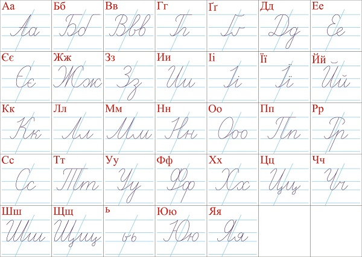

ウクライナ語（Українська мова）は、ウクライナの公用語である。ウクライナ国外においても、諸外国に住むウクライナ人によって使用されている。本国での話者人口は3680万人。本国以外に、ロシア、ベラルーシ、カザフスタン、ポーランド、カナダやアメリカ合衆国などの南北アメリカ、オーストラリアなどにも話者がおり、それらを合計すれば約4500万人になる。スラヴ語派においてはロシア語、ポーランド語に次いで第3位の話者人口である。

## ウクライナ語アルファベット

<!--
 

-->

### 母音
ウクライナ語には硬音（日本語のア行に相当）と軟音(日本語のヤ行に相当)の区別があり、子音の発音に影響する。

### 硬音
**А а**  /a/  日本語のアとほぼ同じ。

---
**Е е**  /e/  日本語のエとほぼ同じ。

---
**И и**  /ɪ/  イの口で発音するウ音。

---
**О о**  /o/  日本語のオとほぼ同じ。

---
**У у**  /u/  日本語よりも唇を尖らせて発音するウ。

### 軟音
**Я я**  /ja/  日本語のヤとほぼ同じ。

---
**Є є**  /je/  イェ音。

---
**І і**  /i/  日本語のイとほぼ同じ。

---
**Ї ї**  /ji/  舌の中央部を少し持ち上げて発音するイ。

---
**Ю ю**  /yu/  日本語よりも唇を尖らせて発音するユ。

### 子音
**П п**
（硬音）/p/ パ行
（軟音）/pʲ/ ピャ音

---
**Б б**
（硬音）/b/ バ行
（軟音）/bʲ/ ビャ音

---
**М м**
（硬音）/m/ マ行
（軟音）/mʲ/ ミャ音

---
**Ф ф**
（硬音）/f/ ファ音（下唇を嚙んで発音する）
（軟音）/fʲ/ フャ音

---
**В в**
（硬音）/v/ ヴァ音(下唇を嚙んで発音する)
（軟音）/vʲ/ ヴャ音

---
**Т т**
（硬音）/t/ タ行
（軟音）/ʨ/ チャ音（日本語とほぼ同じ。舌先を上歯茎裏に当てて発音する）

---
**Д д**
（硬音）/d/ ダ行
（軟音）/ʥ/ ヂャ音（日本語とほぼ同じ。舌先を上歯茎裏に当てて発音する）

---
**Н н**
（硬音）/n/ ナ行
（軟音）/ɲ/ ニャ音

---
**С с**
（硬音）/s/ サ行
（軟音）/ɕ/ シャ音（日本語とほぼ同じ）

---
**З з**
（硬音）/z/ ザ行
（軟音）/ʑ/ ジャ音（舌を上歯茎裏に近付けて息の摩擦で発音する）

---
**Ш ш**
（硬音）/ʃ/ シァ音（日本語より奥まった位置で発音する）
（軟音）/ʃʲ/ シャ音

---
**Ж ж**
（硬音）/ʒ/ ジァ音（日本語より奥まった位置で発音する）
（軟音）/ʒʲ/ ジャ音

---
**Ц ц**
（硬音）/ʦ/ ツァ音
（軟音）/ʦʲ/ ツャ音

---
**"дз"**
（硬音）/ʣ/ ヅァ音
（軟音）/ʣʲ/ ヅャ音

---
**Ч ч**
（硬音）/ʧ/ チァ音（舌の中央を口蓋に当てて発音する）
（軟音）/ʧʲ/ チャ音

---
**"дж"**
（硬音）/ʤ/ ヂァ音（舌の中央を口蓋に当てて発音する）
（軟音）/ʤʲ/ ヂャ音

---
**Щ щ**
/ʃ͡ʧ/ шчの合字

---
**К к**
（硬音）/k/ カ行
（軟音）/c/ キャ音

---
**Ґ ґ**
（硬音）/g/ ガ行
（軟音）/ɟ/ ギャ音

---
**Х х**
（硬音）/x/ ハ音（日本語よりも喉の奥から息を強く摩擦させながら発音する）
（軟音）/ç/ ヒ音（日本語とほぼ同じ）

---
**Г г**
（硬音）/ɦ/ ハ行（日本語よりもやや濁った音）
（軟音）/ɦʲ/ ヒ音

---
**Л л**
（硬音）/l/ ラ行（舌先を上前歯の裏に当てて発音する）
（軟音）/ʎ/ リャ音

---
**Р р**
（硬音）/r/ ラ行（巻き舌で発音する）
（軟音）/rʲ/ リ音

---
**Й й**
（軟音）/jʲ/ ヤ行（舌の中央を持ち上げて発音する。発音構造上、相当する硬音は存在しない）

### その他符号
**ь**  /ʲ/  直前の子音を軟音にする

---
**'**  /ˠ/  直前の子音を硬音にし、後に続く軟音母音と別個に発音する

### アクセント
ウクライナ語のアクセントは強弱アクセントで、アクセントのある母音をやや長めに発音する。

### イントネーション
ウクライナ語では、文章が平叙文か疑問文かをイントネーションで区別する。

### 平叙文の場合
高音から始め、最後の単語のアクセントが付いた音節から低音に移行する。

### 疑問文の場合
低音から始め、質問したい部分の単語、または疑問詞のアクセントが付いた音節のみを高音にする。

### 楽音調
ウクライナ語では、母音や子音が連続しないように発音が変わる場合がある。

**в** は直前か直後に子音が来る場合（単語の語頭にあり、母音が続く場合を除く）、ウ音/u, w/で発音される。

---
**и, у** の二文字は、語頭にあってアクセントを持たない場合、直前の単語が母音で終わるならばそれぞれй, вに置き換えられる。

## 会話集。挨拶

<!--

-->

 

こんにちは。 
Добрий день. (ドーブルィ デーニ)

---
おはようございます。 
Доброго ранку. (ドーブロホ ラーンク)

---
こんばんは。 
Добрий вечір. (ドーブルィ ヴェーチル)

---
おやすみなさい。 
На добраніч. (ナ ドブラーニチ)

---
お元気ですか。 
Як справи? (ヤーク スプラーヴィ)

---
元気です。 
Добре, дякую. (ドーブレ ヂャークユ)

---
お名前は何ですか。 
Як вас звати? (ヤーク ヴァース ズヴァーティ)

---
私の名前は...です。 
Мене звуть ... (メネー ズヴーチ ...)

---
どうぞよろしく。 
Дуже приємно познайомитися. (ドゥジェー プルイェームノ ポズナーヨムヌィトィシャ)

---
お願いします。 
Будь ласка. (ブッヂ ラースカ)

---
どうぞ。 
Прошу. (プローシュー)

---
どうもありがとう。 
Дякую. (ヂャークユ)

---
どういたしまして。 
Прошу. (プローシュー)

---
はい。 
Так. (ターク)

---
いいえ。 
Ні. (ニー)

---
すみません。 
Перепрошую. (ペレプローシュユ)

---
ごめんなさい。 
Вибачте. (ヴィバーチテ)

---
さようなら。 
До побачення. (ポ ポバチェンニャ)

---
ウクライナ語を(うまく)話せません。 
Я не говорю [добре] українською. (ヤー ネ ホヴォリュー (ドーブレ) ウクライーンスィコユ)

---
わかりません。 
Я не розумію. (ヤー ネ ロズミーユ)

---
日本語/英語を話せますか。 
Чи ви говорите японською/англійською? (チィ ヴィ ホヴォールィテ ヤポンスィコユ/アンフリースィコユ)

---
だれか日本語/英語を話せますか。 
Чи хтось говорить японською/англійською? (チ フトースィ ホヴォールィチ ヤポンスィコユ/アンフリースィコユ)

---
トイレはどこですか。 
Де туалет? (デ トゥアレート)

## 標識

<!--

-->

 

開店 
відчинено (ヴィドチィーネノ)

---
閉店 
зачинено (ザチィーネノ)

---
入口 
вхід (ウヒード)

---
出口 
вихід (ヴィーヒド)

---
押 
від себе (ヴィド セベ)

---
引 
до себе (ド セベ)

---
洗面所 
вбиральня (ウブラーリニャ)

---
男性 
чоловічий (チョロヴィーチィイ)

---
女性 
жіночий (ジノーチィイ)

---
禁止 
заборонено (ザボローネノ)

## トラブル

<!--

-->

 

助けて! 
На поміч! (ナポーミチ!)

---
危ない! 
Обережно! (オベレージノ!)

---
ほっといて。
Відчепіться від мене! (ウィッチェピーチシャ　ウィドメネ！)

---
さわらないで! 
Не торкайтеся! (ネ　トルカユテシャ！)

---
警察をよびます。
Я подзвонив до міліції. (ヤ　ポドズボニーフ　ド　ミリツィー)

---
警察! 
Міліція! (ミリーツィヤ!)

---
待て! どろぼう! 
Стій! Злодій! (スチーイ!ズロヂーイ!)

---
助けてください。 
Допоможіть мені.(ドポモジーチ メニー)

---
緊急です。
Це терміново. (ツェ　テルミノーフォ)

---
道に迷っています。 
Я заблудився/заблудилася. (ヤー ザブルディーウシャ/ザブルディーラシャ)

---
鞄をなくしました。
У мене вкрали сумку.(ウ メーネ ウクラーリ スームクー)

---
財布をおとしました。
Я загубив гаманець. (ヤ　ザグービーフ　ハマネーツィ)

---
病気です。 
Я захворів/захворіла. (ヤー ザフヴォリーウ(男)/ザフヴォリ－ラ(女))

---
けがしました。
Я поранений. (ヤ　ポラーネニー)

---
医者を呼んでください。
Викличте лікаря. (ウィークリチテ　リーカリャ) / Будь ласка покличте лікаря. (ブヂ　ラスカ　ポクリーチテ　リーカリャ)

---
電話を使っていいですか? 
Чи можу я скористатися телефоном? (チ　モーズ　ヤ　スコリスターチシャ　テレフォーノン)

## 数字
ウクライナ語の数詞のうち、1と2は直後の名詞の種類によって形が変わる。単体では男性形を用いる。

0 
нуль (ヌーリ)

---
1
（男性形）один (オディーン)
（女性形）одна (オドナー)
（中性形）одне (オドネー)
（複数形）одні (オドニー)

---
2
（男・中性形）два (ドヴァー)
（女性形）дві (ドヴィー)

---
3 
три (トリー)

---
4 
чотири (チョティリ)

---
5 
п'ять (プヤーチ)

---
6 
шість (シースチ)

---
7 
сім (シーム)

---
8 
вісім (ヴィーシム)

---
9 
дев'ять (デーヴヤチ)

---
10 
десять (デースヤチ)

---
11 
одинадцять (オディナーツャチ)

---
12 
дванадцять (ドヴァナーツャチ)

---
13 
тринадцять (トリナーツャチ)

---
14 
чотирнадцять (チョティルナーツャチ)

---
15 
п'ятнадцять (プヤートナーツャチ)

---
16 
шістнадцять (シストナーツャチ)

---
17 
сімнадцять (シムナーツャチ)

---
18 
вісімнадцять (ヴィシムナーツャチ)

---
19 
дев'ятнадцять (デヴヤトナーツャチ)

---
20 
двадцять (ドヴァーツャチ)

---
21 
двадцять один (ドヴァーツャチ オディーン)

---
22 
двадцять два (ドヴァーツャチ ドヴァー)

---
23 
двадцять три (ドヴァーツャチ トリー)

---
30 
тридцять (トルィーツァチ)

---
40 
сорок (ソーロク)

---
50 
п'ятдесят (プヤトデシャート)

---
60 
шістдесят (シズデシャート)

---
70 
сімдесят (シムデシャート)

---
80 
вісімдесят (ヴィシムデシャート)

---
90 
дев'яносто (デヴヤノースト)

---
100 
сто (ストー)

---
200 
двісті (ドヴィースチ)

---
300 
триста (トルィースタ)

---
400 
чотириста (チョティールィスタ)

---
500 
п'ятсот (プヤツォート)

---
600 
шістсот (シストソート)

---
700 
сімсот (シムソート)

---
800 
вісімсот (ヴィシムソート)

---
900 
дев'ятсот (デヴヤツォート)

---
1,000 
тисяча (ティーシャチャー)

---
2,000 
дві тисячі (ドヴィー ティーシャチャー)

---
10,000 
десять тисяч (デースヤチ ティーサチャー)

---
1,000,000 （百万） 
мільйон (ミリヨーン)

---
100,000,000 （一億） 
сто мільйонів (ストー ミリヨーニウ)

---
1,000,000,000 （十億） 
мільярд (ミリヤールド)

---
1,000,000,000,000 （一兆） 
трильйон (トゥルィリヨーン)

---
... 番 （列車・バスなど） 
номер 数字 (ノーメル)

---
半分 
половина (ポロヴィーナ)

---
少ない 
мало (マーロ)

---
多い 
багато (バハート)

## 時間

<!--

-->

 

今 
тепер (テペール) / зараз (ザーラズ)

---
後で 
потім (ポーチム)

---
前に 
раніше (ラニーシェ)

---
... の前に 
перед ... (ペーレド ...)

---
朝/午前 
ранок/до полудня (ラーノク/ド ポルードゥニャ)

---
午後 
після полудня (ピースリャ ポルードゥニャ)

---
夕方 
вечір (ヴェーチル)

---
夜 
ніч (ニーチ)

---
朝6時 
Шоста ранку (ショースタ ラーヌク) / Шоста година ранку (ショースタ ホデイーナ ラーヌク)

---
朝7時 
Сьома ранку (ショウーマ ラーヌ) / Сьома година ранку (ショウーマ ホデイーナ ラーヌク)

---
午前9時
Дев'ята ранку (デビャータ ラーヌク) / Дев'ята година ранку (デビャータ ホデイーナ ラーヌク) / Дев'ята година (デビャータ ホデイーナ)

---
正午 
полудень (ポールデン) / опівдні (オピーウドニ)

---
午後1時 
Перша година дня (ペールシャ ホデイーナ ドニャー)

---
午後2時 
Друга година дня (ドルーハ ホデイーナ ドニャー)

---
夜12時 
Опівночі (オピーウノチ)

---
... 分 
... хвилина/хвилини/хвилин (... フヴィルィーナ/フヴィルィーヌィ/フヴィルィーン)

---
... 時間 
... година/години/годин (... ホディーナ/ホディーヌィ/ホディーン)

---
... 日 
... день/дні/днів (... デーニ/ドゥニー/ドゥニーウ)

---
... 週間 
... тиждень/тижні/тижнів (... ティージュデニ/ティージュニ/ティージュニウ)

---
... ヶ月 
... місяць/місяці/місяців (... ミーシャツィ/ミーシャチ/ミーシャツィウ)

---
... 年 
... рік/роки/років (... リーク/ロークィ/ローキウ)

---
今日 
сьогодні (スィオホードニ)

---
昨日 
вчора (ウチョーラ)

---
明日 
завтра (ザーウトラ)

---
今週 
цей тиждень (ツェイ ティージュデニ)

---
先週 
минулий тиждень (メヌールィ ティージュデニ)

---
来週 
наступний тиждень (ナストゥープヌィ ティージュデニ)

## 曜日
日曜日 
неділя (ネヂーリャ)

---
月曜日 
понеділок (ポネヂーロク)

---
火曜日 
вівторок (ヴィウトーロク)

---
水曜日 
середа (セレダー)

---
木曜日 
четвер (チェートヴェル)

---
金曜日 
п'ятниця (プヤートヌィッツャ)

---
土曜日 
субота (スボータ)

## 月
1月 
січень (シーチェニ)

---
2月 
лютий (リューティイ)

---
3月 
березень (ベーレゼニ)

---
4月 
квітень (クヴィーテニ)

---
5月 
травень (トラーヴェニ)

---
6月 
червень (チェールヴェニ)

---
7月 
липень (ルィーペニ)

---
8月 
серпень (セールペニ)

---
9月 
вересень (ヴェーレセニ)

---
10月 
жовтень (ジョーウテニ)

---
11月 
листопад (ルィストパード)

---
12月 
грудень (フルーデニ)

---
2005年3月24日（火） 
вівторок, двадцять четверте березня дві тисячi п'ятого року (ヴィウトーロク ドゥヴァーツャッチ チェトヴェールテ ベーレズニャ ドゥヴィー ティーシャチ プヤートホ ロークー)

## 色

黒 
чорний (チョールヌィイ)

---
白 
білий (ビールィイ)

---
灰色 
сірий (スィールィイ)

---
赤 
червоний (チェルヴォーヌィイ)

---
青 
синій (セィーヌィイ)

---
黄色 
жовтий (ジョーウティイ)

---
緑 
зелений (ゼレーヌィイ)

---
橙 
помаранчeвий (ポマラーンチョヴィイ)

---
紫 
фіолетовий (フィオレートヴィイ)

---
茶色 
коричневий (コルィーチネヴィイ)

## 交通。バスやメトロや電車

<!--

-->

 

マイクロバス 
мaршруткa (マルシュルーツカ) 

---
バス 
автобус (アウトーブス) 

---
電車 
потяг/поїзд (ポーチャグ/ポーイズド) 

---
... までいくらですか? 
Скільки коштує квиток до ... ? (スキーリクィ コーシュトゥイェ クヴェトーク ド ...) 

---
... まで一枚お願いします 
Один квиток до ..., будь ласка (オディーン クヴェトーク ... ブッヂ ラースカ) 

---
この[電車/バス]はどこへ行きますか
Куди їде цей поїзд/aвтобус (クディー　イーデ　ツェーイ　ポーイズド｜アウトーブス) 

---
この[電車/バス]はどこで止まりますか 
Де зупиняється цей поїзд/aвтобус? (デー　ズペィニャーエシャ　ツェーイ　ポーイズド｜アウトーブス)

---
この[メトロ/バス]はダウンタウンまで行きますか？
Це метро/aвтобус їде в центр містa? (ツェー　メトロー｜アウトーブス　イーデ　ウ　ツェーヌトル　ミースタ？)

## 道順

... はどちらですか? 
Де знаходиться ... ? (デ ズナホーデッツャ ...) 

---
駅 
вокзал (ヴォグザール) 

---
バス停 
зупинка автобуса (ズプィンカ アウトーブサ) 

---
空港 
аеропорт (アエロポールト) 

---
街の中心 
центр міста (ツェーントル ミースタ) 

---
... ホテル 
готель ... (ホテーリ ...) 

---
... 大使館/領事館 
посольство/консульство ... (ポソーリストヴォ/コースリストヴォ ...) 

---
宿 
готель (ホテーリ) 

---
レストラン 
ресторан (レストラーン) 

---
バー 
бар (バール) 

---
見物 
огляд (オーフリャド) 

---
道 
дорога (ドローハ) 

---
左へ曲がってください。
Зверніть ліворуч (ズベルニーチ リヴォールチ) 

---
右へ曲がってください。
Зверніть праворуч (ズヴェルニーチ プラヴォールチ) 

---
左 
ліворуч (リヴォールチ) 

---
右 
праворуч (プラヴォールチ) 

---
まっすぐ 
прямо (プリャーモ) 

---
... へ向かって 
до ... (ド ...)
    
---    
... の先 
за ... (ザ ...) 

---
... の前 
перед ... (ペーレド ...) 

---
... が目印です。 
Ознака є ... (オズナーカ イェ ...) 

---
交差点 
перехрестя (ペレフレースチャ) 

---
北 
північ (ピーウニチ) 

---
南 
південь (ピーウデニ) 

---
東 
схід (スヒード) 

---
西 
захід (ザーヒド) 

## タクシー

<!--

-->

 

タクシー! 
Таксі! (タクスィー) 

---
... までお願いします。 
До ..., будь ласка (ド ... ブッヂ ラースカ) 

---
... までいくらですか? 
Скільки коштує до ... ? (スキーリクィ コーシュトゥイェ ド ...) 

## 主な単語

月 - Місяць (ミーシャツィ)

---
星 - Зірка (ジールカ)

---
世界 - Світ (スヴィート)

---
朝 - Ранок (ラーノク)

---
昼 - День (デーニ)

---
夕方 - Вечір (ヴェーチル)

---
夜 - Ніч (ニーチ)

---
冬 - Зима (ズィマー)

---
春 - Весна (ヴェスナー)

---
夏 - Літо (リート)

---
秋 - Осінь (オーシニ)

---
雲 - Хмара (フマーラ)

---
雪 - Сніг (スニーフ)

---
雨 - Дощ (ドーシュチュ)

---
稲妻 - Блискавка (ブルィースカウカ)

---
水 - Вода (ヴォダー)

---
川 - Річка (リーチカ)

---
湖 - Озеро (オーゼロ)

---
海 - Море (モーレ)

---
平野 - Рівнина (リウヌィーナ)

---
山 - Гора (ホラー)

---
森 - Ліс (リス)

---
草原 - Степ (ステープ)

---
木 - Дерево (デーレヴォ)

---
花 - Квітка (クヴィートカ)

---
サクランボ - Вишня (ヴィシュニャ)

---
パン - Хліб (フリーブ)

---
雄猫 - Кіт (キート)

---
雄犬 - Собака (ソバーカ)

---
牝牛 - Корова (コローヴァ)

---
雄馬 - Кінь (キーニ)

---
雌鶏 - Курка (クールカ)

---
雌山羊 - Коза (コザー)

---
雌羊 - Вівця (ヴィウツャー)

---
雌豚 - Свиня (スヴィニャー)

---
雌狐 - Лисиця (ルィスィーツャ)

---
雄狼 - Вовк (ヴォーウク)

---
雄猪 - Кабан (カバン)

---
雄熊 - Ведмідь (ヴェドミーヂ)

---
雌ネズミ - Миша (ムィーシャ)

---
雄鹿 - Олень (オーレニ)

---
雄ハヤブサ - Сокіл (ソーキル)

---
ミミズク - Пугач (プーハチ)

---
若男 - Козак (コザーク)

---
若女 - Дівчина (ヂーウチナ)

---
老人 - Дід (ヂード)

---
老婆 - Баба (バーバ)

## 外部リンク

* <a href="http://ja.wikipedia.org/wiki/%E3%82%A6%E3%82%AF%E3%83%A9%E3%82%A4%E3%83%8A%E8%AA%9E">ウクライナ語</a>
* <a href="http://wikitravel.org/ja/%E3%82%A6%E3%82%AF%E3%83%A9%E3%82%A4%E3%83%8A%E8%AA%9E%E4%BC%9A%E8%A9%B1%E9%9B%86">ウクライナ語会話集</a>
