全ての国は古代の文化, 習慣, 生活, 仕事の方法で表現し, 伝統的な服を持っている。この全てが鮮やかに保存され、世代から世代へと伝達され、ウクライナの民族衣裳も例外ではない。
ウクライナの人々の伝統、スラブ人々の伝統は密接に結びついている。原則として、女性の衣裳は：シャツ （ソロチカ，コシュゥア、ヴィシヴァンカと言う）、スカート(ヂョルガ、ザパスカ 、プラフタ、アヌダルカといいう）、コルセツか又はベスト、伝統的な靴である。女性の首にビーズネクレスをかけ、頭の上に花から手作りヴェノク又はオチポク、チリツェと言うをかぶる。上着はベストと同じ形でユプカと言う（ジャケット）だった。男性の衣裳は、シャツ（チュマチュカ）とズボン（シャロヴァリ）やベルト、上着（スヴィツカ）と帽子になっている。
ソロチカはウクライナのもっとも古い形であるが、全て刺繍で飾っている。網目模様（デザイン）は飾りだけでなく、お守りとして役立っている。シャツの衿には特別なリボンやボタンなどつけ、衿を固定する。　シャツは部品の接続の種類差があり、　そして刺繍のデザインも地方によって違いがある。

<!--
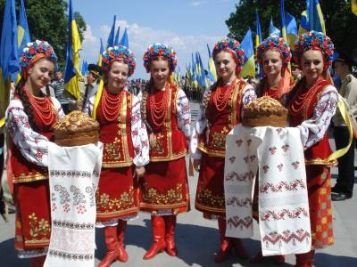
-->

<!--
 
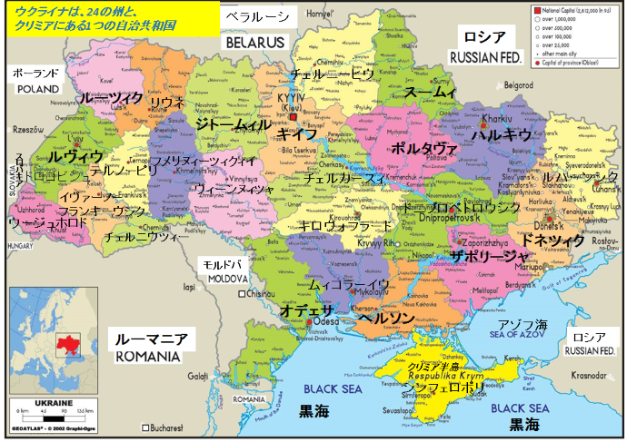
-->

<!--
 
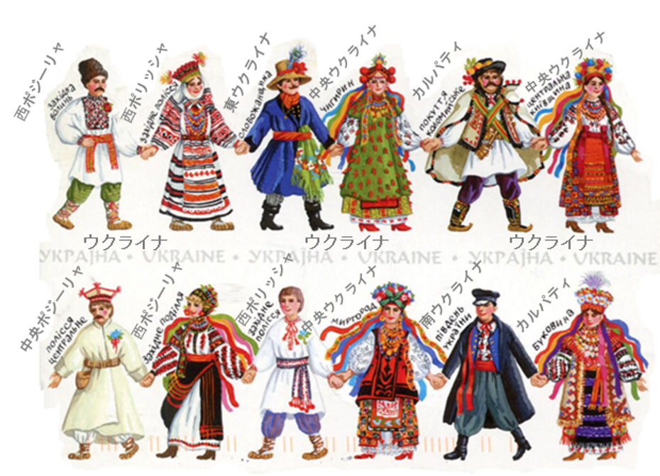
-->

<!--
 
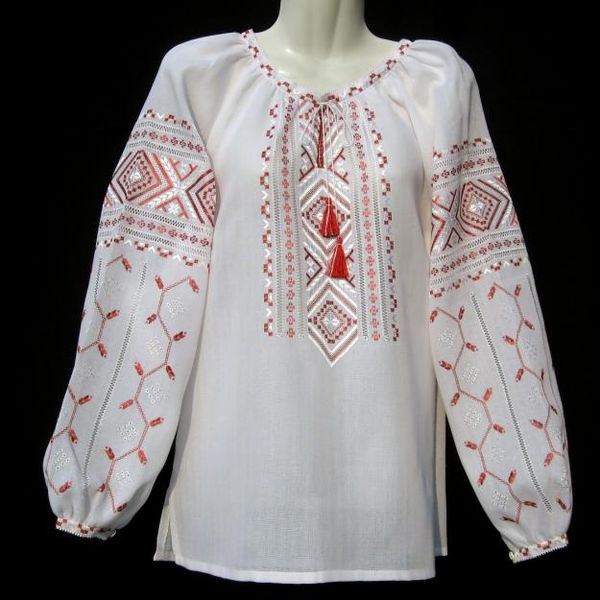
-->

<!--
 
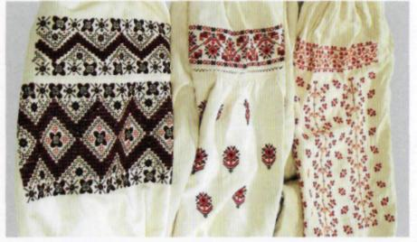
-->

刺繍の色と網目模様も意味を持っている。かけらは悪の勢力から人々を保護し、富、健康と愛をもたらす　ための意味だった。網目模様のデザインは幾何学的な植物や動物かたちのデザインになっていた。
ベルトで服をしめた。社会的な地位で装飾が変わる。 ウクライナ人の伝統的な帽子はお守りとしても使われながら、ステータスや年齢の違いを表した。

<!--
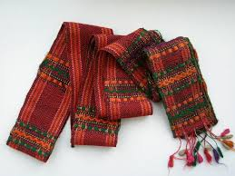
-->

<!--
 
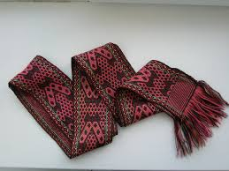
-->

独身の女性は頭の上に、花やリボンなど手作りヴェノクを飾っている。既婚女性はスカーフを独特な方法で結んで又は、ブロケードやシルクで、中は硬いフレームで作られたオチポクか小さい帽子を頭に被る。

<!--
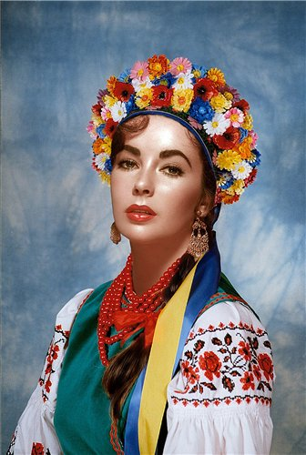
<small>中央ウクライナ・ヴェノク</small>
-->

<!--
 
 
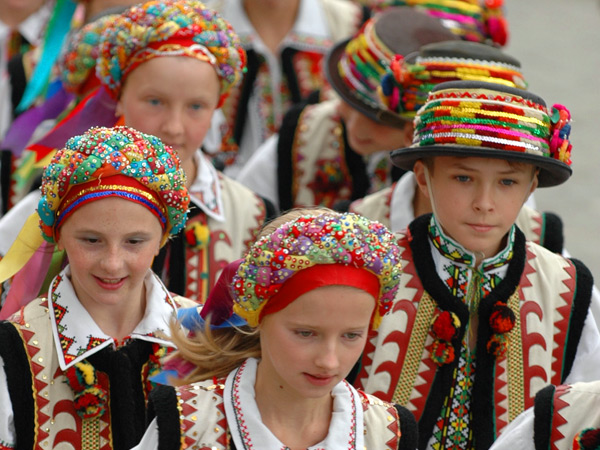
<small>オチポク・カルパティー地域</small>
-->

<!--
 
 
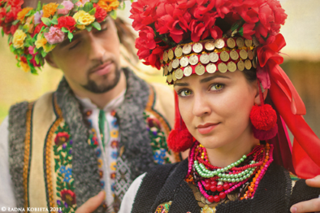
<small>ブコビナヴェノク・西ウクライナ</small>
-->

<!--
 
 

<small>ポジーリャヴェノク</small>
-->

ウクライナの民族衣裳の装飾品はティアラ、ペンダント、ブレスレット、イヤリングなどです。人々は赤いビーズが病気の治療の効果があると信じていた。サンゴやこはくのネックレスは幸運と富を引起せると信じられている。　　　　　

<!--
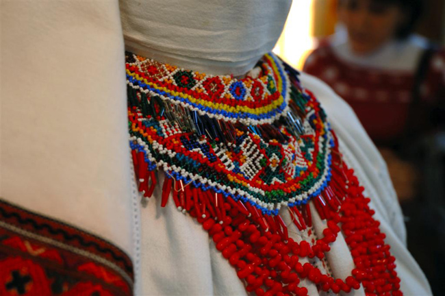
-->

ウケライナの民族衣裳の特徴は色の使い方です。地域によって、民族衣裳は大きな違いがある。現在のウクライナの民族芸術は５つの地方のゾーンに分かれている。

１目のゾーンは中央ウクライナです。

このゾーンに含まれている地域にの衣裳の例です。キイフ、ポルタヴァ、スームィ、北ハルキウ、チェルカースィ、南ジトームィル、北ドニプロペトロウシク、ザポリージャ。

<!--
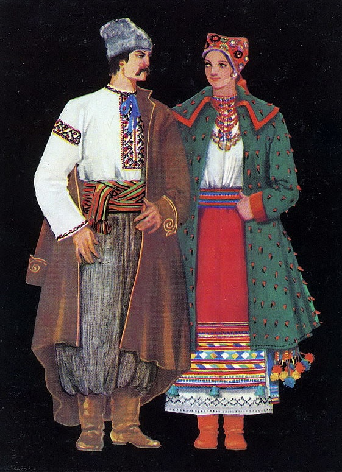
<small>キエフ地域。１９世紀の終わり～２０世紀の初め。</small>
-->

既婚男性の衣裳はシャツ（ソロチカ）、ズボン（シャロヴァリ）、ベルト、上着（スヴィツカ）、
長靴、灰色のカラクル（子羊の毛）でのぼうしで。
既婚女性の衣裳はシャツ（ソロチカ）、ベルト、スカート（ザパスカ）、上着はジャケット（ユプカ）。
頭の上に刺繍の網目模様のスカーフ、サンゴと琥珀のネックレス、イヤリング、リングがあります。

<!--
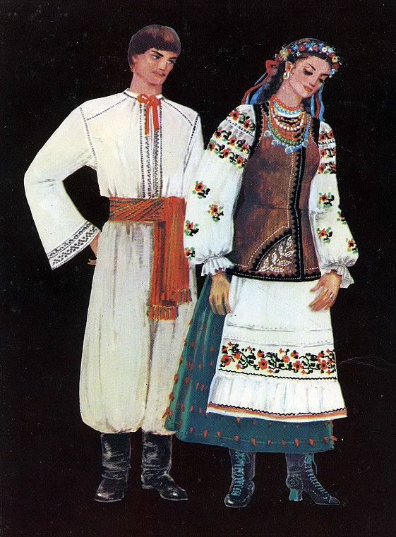
<small>ポルタワ地域。キエフ地域。１９世紀の終わり～２０世紀の初め。</small>
-->

独身男性の衣裳はシャツ（ソロチカ）、ズボン　（シャロヴァリ）、ベルト、長靴です。
独身女性の衣裳はシャツ（ソロチカ）、短いコルセツカ、スカート、エプロン、ヴェノク、ブーツ、赤いビーズ、イヤリング、リングです。

<!--
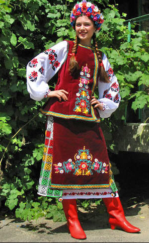
-->

<!--
 
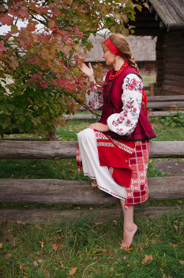
-->

<!--
 
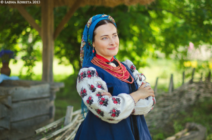
-->

---
© Natalia Zhurova
