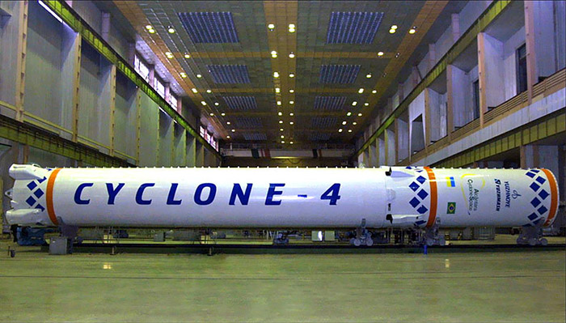

## 世界で有名なウクライナ人

### イーゴリ・イヴァーノヴィチ・シコールスキイ
1889年5月25日 - 1972年10月26日）は、ウクライナのキイフで生まれの航空機のパイオニア。自身飛行家でもあったイーゴリは、世界初の4発の大型機の開発をはじめ、多くの新型機を工業後進国であったロシア帝国で生産した。しかしながら、1917年のロシア革命を受けてアメリカ合衆国へ亡命した。アメリカにおいて彼は近代的なヘリコプターの開発をしました。シコルスキー・エアクラフトの創立者。

<!--

<small>"<a href="http://commons.wikimedia.org/wiki/File:Sikorsky_I.I._1914._Karl_Bulla.jpg#mediaviewer/File:Sikorsky_I.I._1914._Karl_Bulla.jpg">Sikorsky I.I. 1914. Karl Bulla</a>" by <a href="//en.wikipedia.org/wiki/Karl_Bulla" class="extiw" title="en:Karl Bulla">Karl Bulla</a> Licensed under Public domain via <a href="//commons.wikimedia.org/wiki/">Wikimedia Commons</a>.</small>

-->

<!--

<small>"<a href="http://commons.wikimedia.org/wiki/File:Sikorsky_Skycrane_carrying_house_bw.jpg#mediaviewer/File:Sikorsky_Skycrane_carrying_house_bw.jpg">Sikorsky Skycrane carrying house bw</a>". Licensed under Public domain via <a href="//commons.wikimedia.org/wiki/">Wikimedia Commons</a>.</small>

-->

### セルギイ・パーヴロヴィチ・コロリョフ
1907年1月12日 – 1966年1月14日）は、ソビエト連邦の最初期のロケット開発指導者。「スプートニク計画」および「ソ連の宇宙犬」も参照。1957年10月4日に、R-7ロケットにより世界最初の人工衛星スプートニク1号を打ち上げた。有人宇宙船ボストークを開発し、1961年に世界初の有人宇宙飛行としてユーリイ・ガガーリンを宇宙に運んだ。

<!--

<small>"<a href="http://commons.wikimedia.org/wiki/File:Sergey_Korolyov.jpg#mediaviewer/File:Sergey_Korolyov.jpg">Sergey Korolyov</a>" Licensed under Public domain via <a href="//commons.wikimedia.org/wiki/">Wikimedia Commons</a>.</small>

-->

<!--

-->

## ウクライナ製

### シーチ-1（Sich-1、Січ-1）はウクライナ初の人工衛星（1995年）

<!--

-->

	
### 世界で一番大きいな飛虎気はウクライナのAN-225「ムリア」という飛虎気です

<!--

 &nbsp; &nbsp;by&nbsp;<a href='https://www.flickr.com/people/paldies/' target='_blank'>&nbsp;</a><a xmlns:cc='http://creativecommons.org/ns#' rel='cc:attributionURL' property='cc:attributionName' href='https://www.flickr.com/people/paldies/' target='_blank'>Helmuts Guigo</a><a href='http://www.imagecodr.org/' target='_blank'>&nbsp;</a>

-->

### AN-148 (航空機)。用途：大型旅客機。初飛行：2004年12月17日

<!--

-->

### AN-178 (航空機)。用途：輸送機。初飛行：2015年5月7日

<!--

-->

### 「サイクロン・3」（Циклон, Cyclone）はドウクライナで開発された使い捨てロケット

<!--

 &nbsp; &nbsp;by&nbsp;<a href='https://www.flickr.com/people/ipasha/' target='_blank'>&nbsp;</a><a xmlns:cc='http://creativecommons.org/ns#' rel='cc:attributionURL' property='cc:attributionName' href='https://www.flickr.com/people/ipasha/' target='_blank'>ipasha</a><a href='http://www.imagecodr.org/' target='_blank'>&nbsp;</a>

-->

### 新しい「サイクロン・4」ロケットはドニプロペトロフシクで開発中（2015年）

<!--

<small>Website: <a href="http://www.alcantaracyclonespace.com/en/for-customers/project-status">Alcantara Cyclone Space</a></small>
-->

## 外部リンク

* <a href="http://ja.wikipedia.org/wiki/%E3%83%A6%E3%83%BC%E3%82%B8%E3%83%A5%E3%83%9E%E3%82%B7%E3%83%A5">A.M.マカロフ・ユージュニィ機械製造工場</a>
* <a href="http://ja.wikipedia.org/wiki/An-225_%28%E8%88%AA%E7%A9%BA%E6%A9%9F%29">An-225 (航空機)</a>
