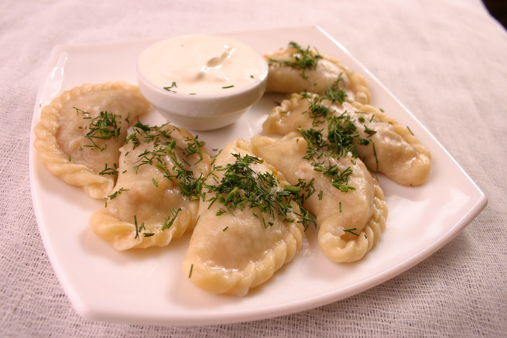

## ボルシチ
ボルシチ（ウクライナ語: борщ, [ボールシュチュ]）は、テーブルビートをもとにしたウクライナの伝統的な料理で、鮮やかな深紅色をした煮込みスープである。

<!--

-->

_具_

- 豚肉　400g
- キャベツ　400g
- テーブルビート　200g
- じゃが芋　300g
- ニンジン　1-2本
- パセリの根　1本
- タマネギ　1個
- トマト　2個
- サーロ　1個
- ディル

_調味料類_

- トマトピューレ　大さじ1-2杯
- バター　大さじ2杯
- 酢（9%）　大さじ半分
- 小麦粉　小さじ1杯
- 砂糖　小さじ1杯
- ニンニク
- 黒胡椒
- ローリエ　2-3枚
- 塩
- サワークリーム

_典型的なウクライナ風ボルシチのつくり方_

1. 水2リットルを鍋で沸騰させ、豚肉でブイヨンを作る。
2. テーブルビートを千切りにし、塩と酢を加えてフライパンに入れる。ブイヨンから集めた油、トマトピューレ、砂糖を焼き、鍋に入れ加えて炒め煮る。
3. タマネギ、ニンジン、パセリの根を千切りにして炒める。
4. 仕上がったブイヨンに四角に切ったじゃが芋を入れて沸騰させる。千切りにしたキャベツを加えて10分から15分にかけて煮る。その後、炒めたテーブルビート、タマネギ、ニンジン、パセリ、輪切りのトマト、黒胡椒、ローリエ、バターで炒めた小麦粉を加える。
5. 5分ほど沸騰させる。その後、パセリの葉とサーロとともにおろしたニンニクを加える。沸騰させた後、火を消し、15分から20分にかけて休ませる。
6. 味が薄かったら、塩で調整する。
7. ボルシチを皿に盛り付け、サワークリームと、細かくちぎったディルを加えて出来上がり。ニンニクのパンプーシュカを添える。

## ヴァレーニキ
ヴァレーヌィクあるいはヴァレーニキ（ウクライナ語：Вареники / 英語：Varenyky）は、欧亜の遊牧民に由来するウクライナの伝統料理の一つ。「ウクライナの餃子」とも。

### カッテージチーズのヴァレーニキ

<!--

-->

_カッテージチーズのヴァレーニキの材料（4人分）_

- カッテージチーズ (500g)
- 卵 (2個)
- 小麦粉 (200g)
- バター (大さじ3杯)
- 砂糖 (大さじ2杯)
- 塩 (適量)

_カッテージチーズのヴァレーニキのつくり方 （4人分）_

1. カッテージチーズをミキサーで細かくします
2. "1"に卵、砂糖、溶かしたバター、塩を入れ、ヘラでかき混ぜます
3. "2"に小麦粉を入れてさらにかき混ぜます。できた生地を棒状に練ります。（長さ25センチ位）
4. 一口大に切り分けます
5. 鍋にお湯を沸騰させ、"4"を入れます。固まらないように、かき混ぜます。写真のように浮かんできたら、３分煮込んで完成！

### ジャガイモのヴァレーニキ

<!--

-->

_生地（具1皿分）_

- 卵、1個
- 小麦粉、グラス1杯半～2杯（量は水分を足すのに何を用いるかによって異なる）
- 水またはサワーミルクあるいはケフィア、グラス半杯
- 塩、小さじ半
- 大きなサイズのジャガイモ、4個
- 中サイズの玉ねぎ、2個
- バター、50グラム
- 塩
- 黒胡椒
- ニンニク、2～3カケ
- 新鮮なディルおよび/またはパセリ、付け合せ用

_つくり方_

1. サワーミルク、卵と塩をまぜ、張りのある生地になるように少しずつ小麦粉を足していく。球状にしたらビニール袋に入れ、15～30分間寝かせておく。 
2. 生地を平らに伸ばし、直径7～8センチ程度のグラスで円形に切り出す。
3. 具をデザートスプーンですくい、円形の生地の中央にのせてヴァレーニキの形に包む。
4. ヴァレーニキを大鍋で10～15分間ゆでる。ヴァレーニキを1個取り出して、試食する。必要ならさらに数分間ヴァレーニキをゆでる。
5. ジャガイモの皮をむいてゆでる。マッシュにして、溶かしたバター（約50グラム）と混ぜる。
6. 2個あるタマネギの1個をみじん切りにし、きつね色になるまで炒める。マッシュポテトと混ぜる。塩コショウを加える。
7. 大鍋に水を張り沸騰させ、ニンニクを2～3カケ加える。ヴァレーニキをゆで、茹で上がったら鍋からすくい出し、大皿にのせる。バターを適量足す。
8. もう1個のタマネギを輪状または半円状に切る。輪状のタマネギを炒め、茹で上がったヴァレーニキの上にのせる。
9. 新鮮なディルとパセリをかける。

### チェリーのヴァレーニキ

<!--

-->

_生地（具1皿分）_

- 卵、1個
- 小麦粉、グラス1杯半～2杯（量は水分を足すのに何を用いるかによって異なる）
- 水またはサワーミルクあるいはケフィア、グラス半杯
- 塩、小さじ半
- 種なしチェリー、350-400 グラム（新鮮なものか缶詰め）
- 砂糖
- サワークリーム

_つくり方_

1. サワーミルク、卵と塩をまぜ、張りのある生地になるように少しずつ小麦粉を足していく。球状にしたらビニール袋に入れ、15～30分間寝かせておく。 
2. 生地を平らに伸ばし、直径7～8センチ程度のグラスで円形に切り出す。
3. 具をデザートスプーンですくい、円形の生地の中央にのせてヴァレーニキの形に包む。
4. ヴァレーニキを大鍋で10～15分間ゆでる。ヴァレーニキを1個取り出して、試食する。必要ならさらに数分間ヴァレーニキをゆでる。
5. 切り抜いた生地の円の中央にベリーを2個配置する。チェリーの酸味が強すぎる場合はいくらかの砂糖を加え、水分を吸い取るためにいくらかの小麦粉も加える。ヴァレーニキを包んでゆでる。
6. サワークリームと砂糖を添えて供する。
7. さあ召し上がれ！

## 外部リンク

* <a href="http://ja.wikipedia.org/wiki/%E3%82%A6%E3%82%AF%E3%83%A9%E3%82%A4%E3%83%8A%E6%96%99%E7%90%86">ウクライナ料理</a>
* <a href="http://ja.wikipedia.org/wiki/%E3%83%9C%E3%83%AB%E3%82%B7%E3%83%81">ボルシチ</a>
* <a href="http://ja.wikipedia.org/wiki/%E3%83%B4%E3%82%A1%E3%83%AC%E3%83%BC%E3%83%8B%E3%82%AD">ヴァレーニキ</a>
