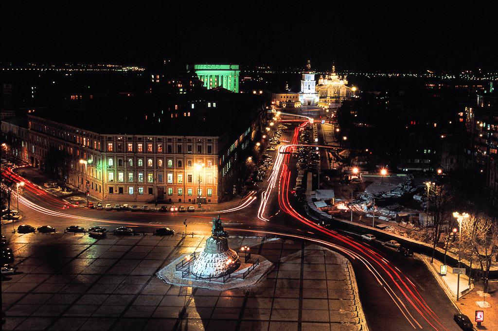

キイフ（ウクライナ語: Київ）は、ウクライナの首都。ドニプロ川の中流に位置する。同国最大の都市で、政治・経済・社会・学術・交通の中心地である。5世紀後半に建設されたポリャーネ族の集落から発展した。中世にはキイフ・ルーシの都であったが、近世にはコサックのキイフ連隊の中心となった。20世紀中にウクライナ人民共和国、ウクライナ国とウクライナ・ソビエト社会主義共和国の首都であり続けた。キイフ市内の人口はおよそ279万人であるが、キイフ首都圏の人口はおよそ400万人となっている。東ヨーロッパにおける最古の都市で、キリスト教の聖地の一つである。都内にある聖ソフィア大聖堂とキイフ洞窟大修道院は世界遺産に登録されている。

### キイフタイムラプス

<!--

<iframe src="http://www.youtube.com/embed/72q3U65daVA?html5=1" frameborder="0"></iframe>

-->

大陸性気候であり、ケッペンの気候区分では湿潤大陸性気候 (Dfb) に属する。最も暑い7月の平均気温は20.5°Cで、時に30°Cを超えることも少なくない。最も寒い1月の平均気温は−3.5°Cで急速に平年値は上昇したものの、近年は寒冬になることも多く、時に零下20度を下回ることも珍しくない。過去最高気温は1936年7月31日観測された39.4 °C、過去最低気温は1929年2月7日と9日に観測された−32.2 °Cである。年間降雪量は355cmと欧州の大都市の中ではかなり多い方である。

###ソフィイフスカ広場 / Sofiivska Square

<!--

<small>Photographer: Max Solomko © / Website: <a href="http://www.maxsolomko.com">www.maxsolomko.com</a></small>
-->

キイフ地下鉄(ウクライナ語:Київський метрополітен)は、ウクライナの首都キイフの市内を走る地下鉄である。2011年現在キイフには3路線、総延長65.18 kmの地下鉄が走っているが、現在新たに1路線が建設工事中であり、また、2号線と3号線は延伸工事中である。

運賃は2015年3月現在、全区間均一4.0フリヴニャである。入場の際は、自動券売機か窓口で非接触型ICカード回数券か、「ジェトン」と呼ばれる青いプラスチック製のトークンを購入し、自動改札機に通す。改札機のランプが赤から緑へ変わる前に入ろうとするとトラブルの原因となる。なお、出場の際はそのまま出るだけである。改札のあるエスカレーターの下部には大抵監視員の女性がいる。運用本数は1分～3分に1本程度の割合であるが、何らかの事情により5分程度間隔が開いたり、所要時間が多くかかったりする場合もある。利用客は、当然のことながら市の中心部に向かって増加する。

### キイフ地下鉄路線網

<!--

-->

###夜のソフィイフスカ広場 / Sofiivska Square at Night

<!--

<small>Photographer: Max Solomko © / Website: <a href="http://www.maxsolomko.com">www.maxsolomko.com</a></small>
-->

###アンドリイフスキ・ウズウィズ通り / Andriivskyi Uzviz Street

<!--

<small>Photographer: Max Solomko © / Website: <a href="http://www.maxsolomko.com">www.maxsolomko.com</a></small>
-->

###アンドリイフスキ・ウズウィズ通り / Andriivskyi Uzviz Street

<!--

<small>Photographer: Max Solomko © / Website: <a href="http://www.maxsolomko.com">www.maxsolomko.com</a></small>
-->

###キメラの家 / House with Chimeras

<!--

<small>Photographer: Max Solomko © / Website: <a href="http://www.maxsolomko.com">www.maxsolomko.com</a></small>
-->

###猫ベヒーモス像、アンドリイフスキ・ウズウィズ通り / Cat Behemoth Statue at Andriivskyi Uzviz Street

<!--

<small>Photographer: Max Solomko © / Website: <a href="http://www.maxsolomko.com">www.maxsolomko.com</a></small>
-->

###ボロジミル王像 / Volodymyr The Great monument

<!--

<small>Photographer: Max Solomko © / Website: <a href="http://www.maxsolomko.com">www.maxsolomko.com</a></small>
-->

###霧の中ドニエプル川 / Dnipro river in fog

<!--

<small>Photographer: Max Solomko © / Website: <a href="http://www.maxsolomko.com">www.maxsolomko.com</a></small>
-->

###独立広場

<!--

 &nbsp; &nbsp;by&nbsp;<a href='https://www.flickr.com/people/peatc/' target='_blank'>&nbsp;</a><a xmlns:cc='http://creativecommons.org/ns#' rel='cc:attributionURL' property='cc:attributionName' href='https://www.flickr.com/people/peatc/' target='_blank'>peatc</a><a href='http://www.imagecodr.org/' target='_blank'>&nbsp;</a>

-->

###インスチツツカ通り

<!--

 &nbsp; &nbsp;by&nbsp;<a href='https://www.flickr.com/people/mattsh/' target='_blank'>&nbsp;</a><a xmlns:cc='http://creativecommons.org/ns#' rel='cc:attributionURL' property='cc:attributionName' href='https://www.flickr.com/people/mattsh/' target='_blank'>Matt. Create.</a><a href='http://www.imagecodr.org/' target='_blank'>&nbsp;</a>

-->

###キイフ・ペチェールシク大修道院

<!--

 &nbsp; &nbsp;by&nbsp;<a href='https://www.flickr.com/people/mattsh/' target='_blank'>&nbsp;</a><a xmlns:cc='http://creativecommons.org/ns#' rel='cc:attributionURL' property='cc:attributionName' href='https://www.flickr.com/people/mattsh/' target='_blank'>Matt. Create.</a><a href='http://www.imagecodr.org/' target='_blank'>&nbsp;</a>

-->

###キイフの冬

<!--

 &nbsp; &nbsp;by&nbsp;<a href='https://www.flickr.com/people/39997856@N03/' target='_blank'>&nbsp;</a><a xmlns:cc='http://creativecommons.org/ns#' rel='cc:attributionURL' property='cc:attributionName' href='https://www.flickr.com/people/39997856@N03/' target='_blank'>mariusz kluzniak</a><a href='http://www.imagecodr.org/' target='_blank'>&nbsp;</a>

-->

###フレシチャーティク通り

<!--

 &nbsp; &nbsp;by&nbsp;<a href='https://www.flickr.com/people/jlascar/' target='_blank'>&nbsp;</a><a xmlns:cc='http://creativecommons.org/ns#' rel='cc:attributionURL' property='cc:attributionName' href='https://www.flickr.com/people/jlascar/' target='_blank'>Jorge Lascar</a><a href='http://www.imagecodr.org/' target='_blank'>&nbsp;</a>

-->

###夜の独立広場

<!--

 &nbsp; &nbsp;by&nbsp;<a href='https://www.flickr.com/people/thisisbossi/' target='_blank'>&nbsp;</a><a xmlns:cc='http://creativecommons.org/ns#' rel='cc:attributionURL' property='cc:attributionName' href='https://www.flickr.com/people/thisisbossi/' target='_blank'>thisisbossi</a><a href='http://www.imagecodr.org/' target='_blank'>&nbsp;</a>

-->

## 外部リンク
* <a href="http://ja.wikipedia.org/wiki/%E3%82%AD%E3%82%A8%E3%83%95">キイフ (ウィキペディア)</a>
* <a href="http://ja.wikipedia.org/wiki/%E3%82%AD%E3%82%A8%E3%83%95#.E4.BA.A4.E9.80.9A">キイフ地下鉄 (ウィキペディア)</a>
* <a href="http://www.pbase.com/bmcmorrow/kiev">キイフの写真</a>
* <a href="http://www.dtac.jp/caucasus/ukraine/entry_133.php">キイフ観光客のための情報</a>
* <a href="http://www.maxsolomko.com">www.maxsolomko.com</a>
