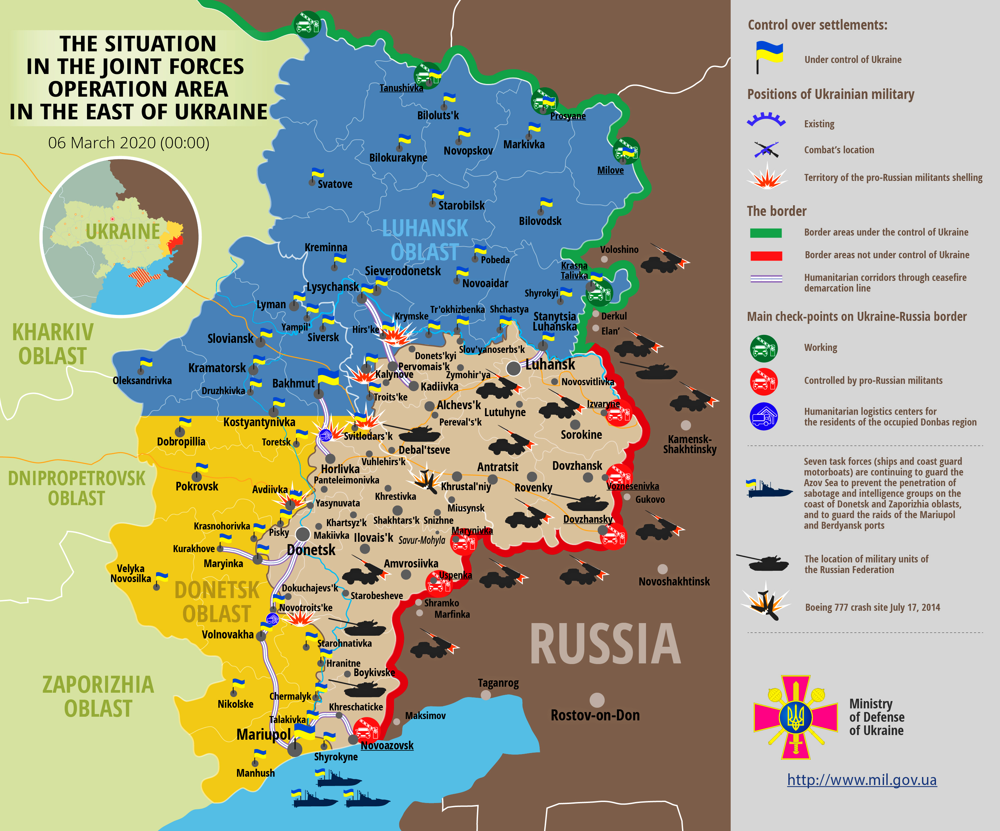

ドンバス（ウクライナ語: Донбас）は、ウクライナの地名である。現在のドネツィク州とルハーンシク州にあたる。石炭の豊富な地域として知られ、ドネツ炭田は世界的に有名である。中心都市はドネツィク。(ロシア軍侵攻)

### ウクライナ・ロシア戦争
2014年からロシアがドンバスに侵攻中です。

<!--

-->

### ドンバスタイムラプス

<!--

<iframe src="https://www.youtube.com/embed/sot6-bGenhQ?html5=1" frameborder="0"></iframe>

-->

### カールミウス川の堤防

<!--

-->

### ドネツク地域の国家管理（2014年まで）

<!--

-->

### 夜のドネツク

<!--

-->

### ドネツクオペラバレエ劇場

<!--

-->

### ドネツク中心部

<!--

-->

### ルハーニ川

<!--

 By <a href="//commons.wikimedia.org/wiki/User:Riwnodennyk" title="User:Riwnodennyk">Riwnodennyk</a> - self-made. Also <a rel="nofollow" class="external text" href="https://www.panoramio.com/user/530579">Panoramio</a>, <a href="https://creativecommons.org/licenses/by-sa/4.0" title="Creative Commons Attribution-Share Alike 4.0">CC BY-SA 4.0</a>, <a href="https://commons.wikimedia.org/w/index.php?curid=3183200">Link</a>

-->

### ドネツ川

<!--

-->

### 生神女就寝スヴャトヒルシク修道院

<!--

-->

### ドネツィク国際空港（2014年まで）

<!--

 By <a href="//commons.wikimedia.org/w/index.php?title=User:Michael1238&amp;action=edit&amp;redlink=1" class="new" title="User:Michael1238 (page does not exist)">Michael1238</a> - Own work, <a href="https://creativecommons.org/licenses/by-sa/3.0" title="Creative Commons Attribution-Share Alike 3.0">CC BY-SA 3.0</a>, <a href="https://commons.wikimedia.org/w/index.php?curid=32214434">Link</a>

-->

### 戦闘により破壊されたドネツィク空港（2014年12月からロシア軍侵攻です)

<!--

-->

## 外部リンク
* <a href="https://ja.wikipedia.org/wiki/%E3%83%89%E3%83%B3%E3%83%90%E3%82%B9">ドンバス</a>
